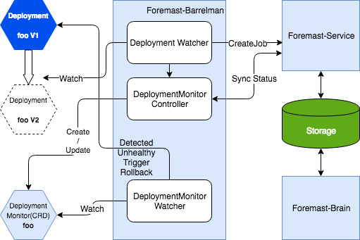

# Core Components

## 

## Foremast-Barrelman

Barrelman is a component to watch the Deployment change in DeploymentTime and start to monitor the deployment metrics or related information, make sure the deployment will be healthy. If it detects unhealthy status, it can trigger remediation actions.  The monitoring can be triggered by kubectl or foremast UI in the future. So that Barrelman can watch the application status in runtime also.

## Foremast-Judgement Framework

### Foremast-AI-API

Formast-AI-API provide internal Restful APIs . There are two main APIs. One is  create Foremast-Judgement request. Formast-AI-API will validate the request , store to data store, publish the request to message bus \(future release\) and then return jobID response.

Formast-AI-API client can based on jobID to invoke Formast-AI-API to retrieve the status of job. Once Foremost Judgement completed the application health judgement, it will return health, un-health or unknown\(if current metric is not there\).

### Foremast-AI-Engine

Foremast-AI-Engine is consumer of the Foremast Judgement request. It is brain of Foremast. 

V1.0 does not have message bus. Foremast-AI-Engine will retrieve the oldest  open request based on  last modified time and reserve the request to process.

There are 6 different status : initial , in progress , reprocess, completed health , complete un-health and completed unknown.

Abort is abort by client.

If any anomaly got detected , Foremast-AI-Engine will mark the statue as completed un-health before endTime is reached. Otherwise, Foremast-AI-Engine will continuous to monitor and check if there is any anomaly until endTime is reached.

**Scalability**  we can add more Foremast-AI-Engine to scale

**Fault Tolerant**  If there is any request is processed more than X minute \(configurable\), other Foremast-AI-Engine will take over and reprocess the request.

