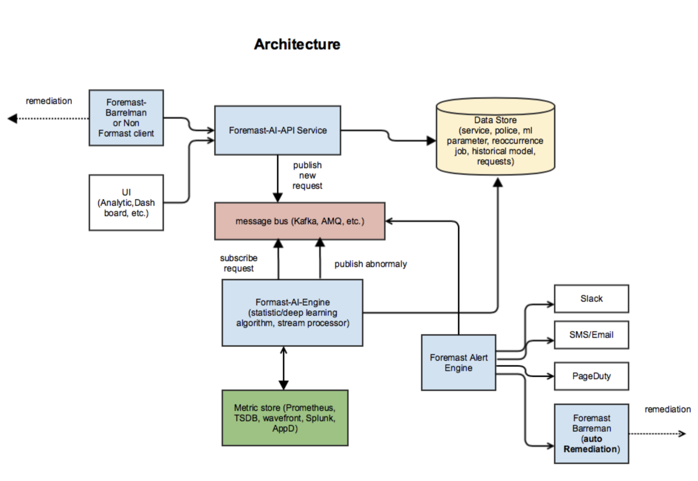

# Design

### Formast-AI-API Rest Service

Formast-AI-API service offers several internal APIs that interact with the underly Data Store, publish the request message to message and provide application health or un-health result to Formast-Barrelmn, non Foremast client or UI. 

Formast-AI-API service can also retrieve config from data store and trigger the re-occurring request, publish the request to message bus.

### Foremast-AI-Engine

Foremast-AI-Engine is consumer of the message. It can scale to multiple consumers. 

Based on the configuration it will first query the historical metric from metric store, compute the machine learning/statistic algorithm model,  for canary pre-deployment stage it will query the baseline and current metric and perform pairwise algorithm to check if both have same distribution pattern,  if current and baseline has different distribution pattern, it will be lower threshold. and then use threshold to detect current anomaly data points based on  historical mode .

## 

## Algorithms 

For v1.0 we will pick different default algorithm base one number of metric types. User can overwrite the default algorithm via the environment variables.  

For future release we will introduce model advisory component.  If user does not define the algorithm , model advisory will periodically evaluate different algorithms and pick the best one. 

One metric Types:

Two metric Types:

Three or more metric Types:

