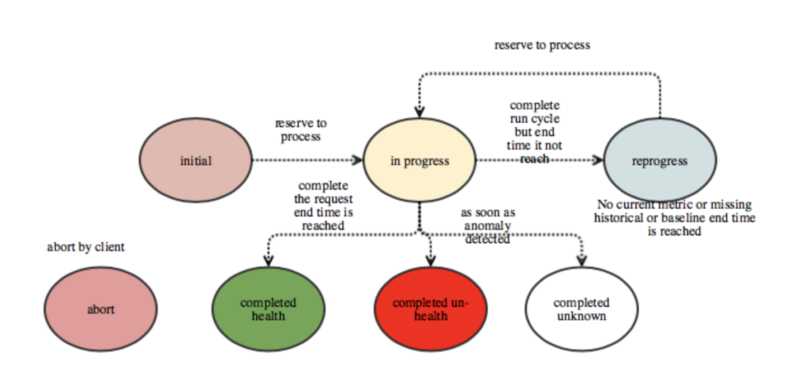

# Design

### Foremast Service

Foremast service offers internal APIs that interacts with the underly Data Store, publish the request message to message bus, retrieve the request status  to Service Client.  

There are two main Restful API. One is create request. Foremast Service will validate the request , store to data store, publish the request to message bus \(future release\) and then return id response.

The the second one is  search by id. Client can base on id to retrieve the status of request . Once Foremost Brain completed the application health judgement, it will return health, un-health or unknown\(if current metric is not there\) with reason.

In the future release Foremast can support re-occurring monitoring request.

Foremast service will  monitor , schedule  the tasks based on request status and configuration.

### Foremast Brain

Foremast Brain is consumer of the Foremast service request. It is brain of Foremast.

Foremast Brain is scale, fault tolerant and shard-nothing.

Based on the configuration it will first query the historical metric from metric store, compute the machine learning/statistic algorithm model,  for canary deployment  it will query the baseline and current metric and perform pairwise algorithm to check if both have same distribution pattern,  if current and baseline has different distribution pattern, it will be lower threshold. and then use threshold to detect current anomaly data points based on  historical mode .

V1.0 does not have message bus. Foremast Brain will retrieve the oldest open request based on last modified time and reserve the request to process.

There are 6 different status : initial , in progress , reprocess, completed health , complete un-health and completed unknown.

Abort is abort by client.

**Detect Anomaly Fast**: If any anomaly got detected , Foremast Brain will mark the statue as completed un-health before endTime is reached. Otherwise, Foremast-AI-Engine will continuous to monitor and check if there is any anomaly until endTime is reached.

### Scalability, Fault Tolerant and Shared-Nothing

we can add more Foremast-AI-Engine pod to scale

If there is any request is processed more than X minute \(configurable\), other Foremast-AI-Engine will take over and reprocess the request.

### Monitoring/Alerting

We leverage ElasticSearch as datastore to store the request content and status. Foremast-Ai-Engine will not only update the request status but also provide reason.

You can locate the request status and detail via Kibana dashboard. You can also config alert.

### Algorithms 

For v1.0 we will pick different default algorithm base one number of metric types. User can overwrite the default algorithm via the environment variables.  

For future release we will introduce model advisory component.  If user does not define the algorithm , model advisory will periodically evaluate different algorithms and pick the best one. 

#### One metric Types:

Moving Average

Exponential Smoothing

Double Exponential Smoothing

Holt-Winters

Prophet \(facebook\)

#### Two metric Types:

Bivariate Normal Distribution

#### Three or more metric Types:

Deep Learning \(LSTM\)

#### We also support pairwise algorithm  \(baseline vs current\)

**Compare Two:**

Mann-Whitney , Wilcoxon, Kruskal  

**Compare Two more :**

 Kruskal  

Fried manchi square \(special case\)

